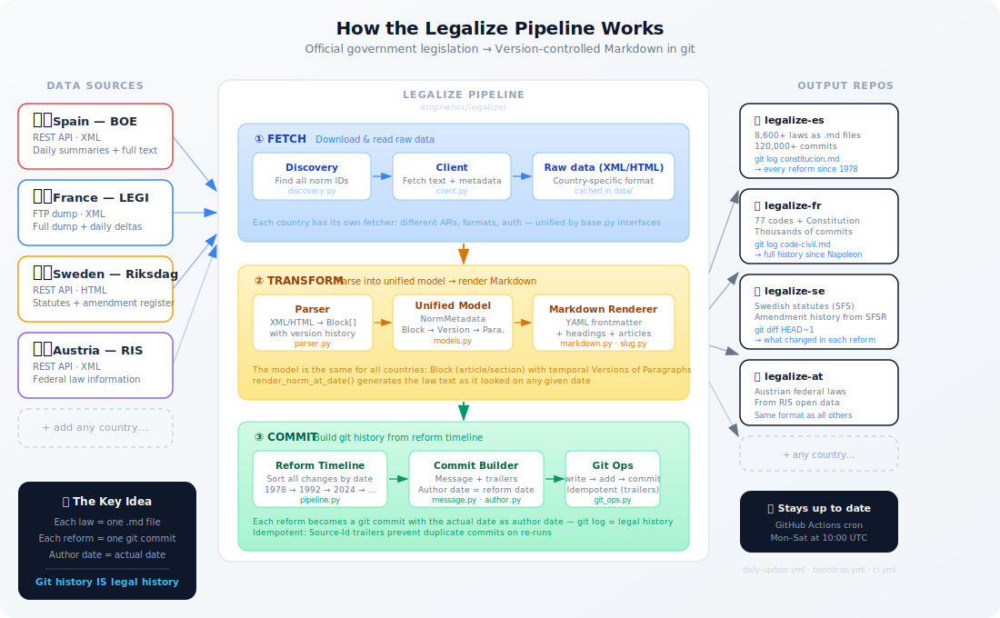

# legalize-pipeline

[](https://github.com/legalize-dev/legalize-pipeline/actions/workflows/ci.yml)
[](https://www.python.org/downloads/)
[](LICENSE)

The engine behind **[legalize.dev](https://legalize.dev)** -- converts official legislation into version-controlled Markdown in Git.

Each law is a file. Each reform is a commit. Every country is a repo.

## How it works



## Public repos (output)

| Country | Repo | Source |
|---------|------|--------|
| Andorra | [legalize-ad](https://github.com/legalize-dev/legalize-ad) | BOPA |
| Argentina | [legalize-ar](https://github.com/legalize-dev/legalize-ar) | InfoLEG |
| Austria | [legalize-at](https://github.com/legalize-dev/legalize-at) | RIS (Bundeskanzleramt) |
| Belgium | [legalize-be](https://github.com/legalize-dev/legalize-be) | Justel (Belgisch Staatsblad) |
| Chile | [legalize-cl](https://github.com/legalize-dev/legalize-cl) | BCN (LeyChile) |
| Czech Republic | [legalize-cz](https://github.com/legalize-dev/legalize-cz) | e-Sbirka |
| Estonia | [legalize-ee](https://github.com/legalize-dev/legalize-ee) | Riigi Teataja |
| France | [legalize-fr](https://github.com/legalize-dev/legalize-fr) | LEGI (Legifrance) |
| Germany | [legalize-de](https://github.com/legalize-dev/legalize-de) | gesetze-im-internet.de |
| Greece | [legalize-gr](https://github.com/legalize-dev/legalize-gr) | ET (Ethniko Typografeio) |
| Italy | [legalize-it](https://github.com/legalize-dev/legalize-it) | Normattiva |
| Latvia | [legalize-lv](https://github.com/legalize-dev/legalize-lv) | likumi.lv (Latvijas Vestnesis) |
| Lithuania | [legalize-lt](https://github.com/legalize-dev/legalize-lt) | TAR (data.gov.lt) |
| Netherlands | [legalize-nl](https://github.com/legalize-dev/legalize-nl) | BWB (wetten.overheid.nl) |
| Poland | [legalize-pl](https://github.com/legalize-dev/legalize-pl) | Dziennik Ustaw (Sejm ELI) |
| Portugal | [legalize-pt](https://github.com/legalize-dev/legalize-pt) | DRE (Diario da Republica) |
| Spain | [legalize-es](https://github.com/legalize-dev/legalize-es) | BOE |
| Sweden | [legalize-se](https://github.com/legalize-dev/legalize-se) | SFSR (Riksdag) |
| Uruguay | [legalize-uy](https://github.com/legalize-dev/legalize-uy) | IMPO |

## Architecture

```
src/legalize/
  fetcher/              # Country-specific data fetching
    base.py               Abstract interfaces (LegislativeClient, NormDiscovery, TextParser, MetadataParser)
    es/                   Spain (BOE API)
      client.py             HTTP client with rate limiting, caching
      discovery.py          Norm discovery via catalog + sumarios
      parser.py             BOE XML -> Block/NormMetadata
    fr/                   France (LEGI XML dump)
      client.py             Local XML dump reader
      discovery.py          Filesystem-based discovery
      parser.py             LEGI XML -> Block/NormMetadata
    de/                   Germany (gesetze-im-internet.de)
      client.py             GIIClient: ZIP download + XML extraction
      discovery.py          TOC XML discovery (~6900 laws)
      parser.py             gii-norm XML -> Block/NormMetadata
    se/                   Sweden (SFSR / Riksdag)
      client.py             Riksdag API client
      discovery.py          SFS catalog discovery
      parser.py             Swedish XML -> Block/NormMetadata
    ad/                   Andorra (BOPA)
    ar/                   Argentina (InfoLEG)
    at/                   Austria (RIS OGD API)
    be/                   Belgium (Justel)
    cl/                   Chile (BCN / LeyChile)
    cz/                   Czech Republic (e-Sbirka)
    ee/                   Estonia (Riigi Teataja)
    gr/                   Greece (ET)
    it/                   Italy (Normattiva AKN)
    lt/                   Lithuania (TAR / data.gov.lt)
    lv/                   Latvia (likumi.lv HTML scraping with sitemap discovery)
    nl/                   Netherlands (BWB / wetten.overheid.nl)
    pl/                   Poland (Dziennik Ustaw / Sejm ELI)
    pt/                   Portugal (DRE SQLite dump)
    ua/                   Ukraine (data.rada.gov.ua)
    uy/                   Uruguay (IMPO)
  transformer/          # Generic: XML -> Markdown
    xml_parser.py         Bloque/Version extraction, reform timeline
    markdown.py           Bloque -> Markdown (CSS class mapping)
    frontmatter.py        YAML frontmatter rendering
    slug.py               norm_to_filepath() -> {country_dir}/{id}.md
  committer/            # Generic: Markdown -> git commits
    git_ops.py            Git operations with historical dates
    message.py            Commit message formatting (6 types)
    author.py             Author from git config (whoever runs the pipeline)
  state/                # Pipeline state tracking
    store.py              Last processed summary, run history
  countries.py          # Country registry (lazy import dispatch)
  config.py             # Config + CountryConfig from config.yaml
  models.py             # Domain models (generic, multi-country)
  storage.py            # Save XML + JSON to data/ (intermediate cache)
  pipeline.py           # Generic orchestration (fetch, commit, bootstrap, daily, reprocess)
```

## Prerequisites

- Python 3.12+
- Git

## Quick start

```bash
git clone https://github.com/legalize-dev/legalize-pipeline.git
cd legalize-pipeline

pip install -e ".[dev]"

# Run tests
pytest tests/ -v

# Lint
ruff check src/ tests/
```

## CLI

All commands use a unified `--country` / `-c` flag:

```bash
# Fetch laws to data/ (does not touch git)
legalize fetch -c es --catalog             # Spain: full BOE catalog
legalize fetch -c fr --all --legi-dir /path # France: all codes from LEGI dump
legalize fetch -c se --all                  # Sweden: all statutes from SFSR
legalize fetch BOE-A-1978-31229             # Single law by ID

# Generate git commits from local data/ (does not download)
legalize commit -c es --all
legalize commit -c fr --all

# Full pipeline: fetch + commit
legalize bootstrap                          # Spain (default)
legalize bootstrap -c fr --legi-dir /path   # France
legalize bootstrap -c se                    # Sweden

# Daily incremental update
legalize daily -c es --date 2026-03-28

# Reprocess specific norms
legalize reprocess -c es --reason "bug fix" BOE-A-1978-31229

# Pipeline status
legalize status
```

## Adding a new country

1. Create `fetcher/{code}/` with `client.py`, `discovery.py`, `parser.py`
2. Implement the 4 interfaces from `fetcher/base.py`:
   - `LegislativeClient` -- fetch raw data
   - `NormDiscovery` -- discover all laws in catalog
   - `TextParser` -- parse into `Bloque` objects
   - `MetadataParser` -- parse into `NormaMetadata`
3. Register in `countries.py` REGISTRY
4. Add `countries:` section to `config.yaml`

See [ADDING_A_COUNTRY.md](ADDING_A_COUNTRY.md) for the full walkthrough.

## Countries

| Country | Status | Source | Repo |
|---------|--------|--------|------|
| Andorra | Live | [BOPA](https://www.bopa.ad/) | [legalize-ad](https://github.com/legalize-dev/legalize-ad) |
| Argentina | Live | [InfoLEG](http://www.infoleg.gob.ar/) | [legalize-ar](https://github.com/legalize-dev/legalize-ar) |
| Austria | Live | [RIS](https://www.ris.bka.gv.at/) | [legalize-at](https://github.com/legalize-dev/legalize-at) |
| Belgium | Live | [Justel](https://www.ejustice.just.fgov.be/) | [legalize-be](https://github.com/legalize-dev/legalize-be) |
| Chile | Fetcher ready | [BCN](https://www.leychile.cl/) | [legalize-cl](https://github.com/legalize-dev/legalize-cl) |
| Czech Republic | Fetcher ready | [e-Sbirka](https://www.e-sbirka.cz/) | [legalize-cz](https://github.com/legalize-dev/legalize-cz) |
| Estonia | Live | [Riigi Teataja](https://www.riigiteataja.ee/) | [legalize-ee](https://github.com/legalize-dev/legalize-ee) |
| France | Live | [Legifrance](https://www.legifrance.gouv.fr/) | [legalize-fr](https://github.com/legalize-dev/legalize-fr) |
| Germany | Live | [gesetze-im-internet.de](https://www.gesetze-im-internet.de/) | [legalize-de](https://github.com/legalize-dev/legalize-de) |
| Greece | Live | [ET](https://www.et.gr/) | [legalize-gr](https://github.com/legalize-dev/legalize-gr) |
| Italy | Fetcher ready | [Normattiva](https://www.normattiva.it/) | [legalize-it](https://github.com/legalize-dev/legalize-it) |
| Latvia | Live | [likumi.lv](https://likumi.lv/) | [legalize-lv](https://github.com/legalize-dev/legalize-lv) |
| Lithuania | Live | [TAR](https://www.e-tar.lt/) | [legalize-lt](https://github.com/legalize-dev/legalize-lt) |
| Netherlands | Live | [BWB](https://wetten.overheid.nl/) | [legalize-nl](https://github.com/legalize-dev/legalize-nl) |
| Poland | Live | [Dziennik Ustaw](https://isap.sejm.gov.pl/) | [legalize-pl](https://github.com/legalize-dev/legalize-pl) |
| Portugal | Live | [DRE](https://dre.pt/) | [legalize-pt](https://github.com/legalize-dev/legalize-pt) |
| Spain | Live | [BOE](https://www.boe.es/) | [legalize-es](https://github.com/legalize-dev/legalize-es) |
| Sweden | Live | [Riksdag](https://www.riksdagen.se/) | [legalize-se](https://github.com/legalize-dev/legalize-se) |
| Ukraine | Fetcher ready | [Rada](https://data.rada.gov.ua/) | -- |
| Uruguay | Live | [IMPO](https://www.impo.com.uy/) | [legalize-uy](https://github.com/legalize-dev/legalize-uy) |

Want to add your country? See [ADDING_A_COUNTRY.md](ADDING_A_COUNTRY.md).

## Contributing

We welcome contributions, especially new country parsers. See [CONTRIBUTING.md](CONTRIBUTING.md) and [ADDING_A_COUNTRY.md](ADDING_A_COUNTRY.md).

## License

MIT
